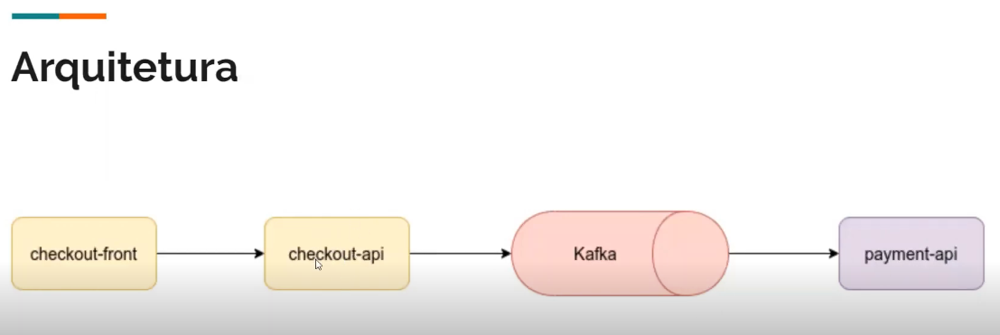

# Ecommerce API

Este projeto tem como objetivo documentar e expor o funcionamento de uma api de pagamento de um ecommerce com
spring boot e orientado a eventos.

### Técnologias do Projeto

* Java 17
* Maven
* Spring Doc V3
* Spring Boot 3.1.0

# Arquitetura

Este projeto segue a seguinte arquitetura

    

